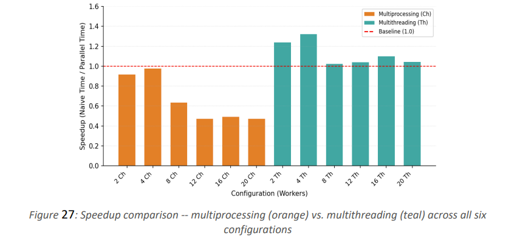

# Operating Systems — Project 1

<p align="center">
  
  
  
  
</p>

---

## Project Overview

This project processes a dataset containing **1,000,000 records divided into 20 files**.

The program allows the user to search by:

1. Country
2. Item Type
3. Sales Channel

After entering a search value, the program calculates:

- Total number of orders
- Total revenue
- Processing time

The same task is implemented using three different approaches:

- Naive
- Multiprocessing
- Multithreading

The purpose of the project is to compare sequential processing with process-based and thread-based parallel processing.

---

## Dataset

- **Records:** 1,000,000
- **Files:** 20
- **Format:** CSV
- **Data fields used:** Country, Item Type, Sales Channel, Revenue

The program loads the 20 files and stores the records in memory before processing the search.

The dataset loading time is not included in the reported processing time. Timing starts after the dataset has been loaded into memory.

---

## User Input

The program displays the following menu:

```text
Search by:
1. Country
2. Item Type
3. Sales Channel

Choice (1-3):
```

The user then enters the value to search for.

Example:

```text
Choice: 1
Enter search term: Ireland
```

The search is case-insensitive.

---

# Approaches

## 1. Naive Approach

The Naive implementation processes all records sequentially using a single process.

No child processes or threads are used.

```text
Main Process
     |
     +-- Record 1
     +-- Record 2
     +-- Record 3
     +-- ...
     +-- Record 1,000,000
```

The naive implementation is used as the baseline for calculating speedup.

---

## 2. Multiprocessing Approach

The Multiprocessing implementation uses multiple child processes created with `fork()`.

The tested configurations are:

- 2 processes
- 4 processes
- 8 processes
- 12 processes
- 16 processes
- 20 processes

Each process handles a portion of the dataset. Pipes are used to send partial results back to the parent process, and `waitpid()` is used to wait for the child processes.

```text
                  Parent Process
                       |
           +-----------+-----------+
           |           |           |
         Child       Child       Child
           |           |           |
        Records     Records     Records
           |           |           |
           +-----------+-----------+
                       |
                  Final Results
```

---

## 3. Multithreading Approach

The Multithreading implementation uses POSIX threads.

The tested configurations are:

- 2 threads
- 4 threads
- 8 threads
- 12 threads
- 16 threads
- 20 threads

Each thread processes part of the dataset.

`pthread_create()` is used to create the threads, while `pthread_join()` waits for all threads to finish. A mutex is used to safely update the shared result.

```text
                  Main Thread
                       |
           +-----------+-----------+
           |           |           |
        Thread 1    Thread 2    Thread 3
           |           |           |
        Records     Records     Records
           |           |           |
           +-----------+-----------+
                       |
                  Final Results
```

---

# Key Code Logic

The three implementations perform the same search operation on the same dataset. The main difference is how the records are processed:

- **Naive:** processes all records sequentially.
- **Multiprocessing:** divides the work among multiple child processes.
- **Multithreading:** divides the work among multiple threads.

---

## 1. Naive Approach

The naive implementation processes the entire dataset sequentially using a single execution flow.

### Selecting the Search Field

The program checks which field the user selected:

```c
int field_matches(const Record* r, int choice, const char* term) {
    switch (choice) {
        case 1:
            return strcasecmp(r->country, term) == 0;

        case 2:
            return strcasecmp(r->item_type, term) == 0;

        case 3:
            return strcasecmp(r->sales_channel, term) == 0;
    }

    return 0;
}
```

### Sequential Processing

The program then checks every record one by one:

```c
Results process_sequential(
    Dataset* dataset,
    int choice,
    const char* search_term
) {
    Results results = {0, 0.0};

    for (int i = 0; i < dataset->count; i++) {
        if (field_matches(
                &dataset->records[i],
                choice,
                search_term)) {

            results.orders++;
            results.revenue +=
                dataset->records[i].revenue;
        }
    }

    return results;
}
```

### How It Works

```text
Dataset
   |
   v
Record 1
   |
   v
Check Match
   |
   v
Record 2
   |
   v
Check Match
   |
   v
Record 3
   |
   v
Check Match
   |
   v
...
   |
   v
Last Record
   |
   v
Final Result
```

There is only one execution flow, so records are processed one after another.

### Measuring Processing Time

The processing time is measured around the sequential search:

```c
double start_time = get_time();

Results results =
    process_sequential(
        &dataset,
        choice,
        search
    );

double end_time = get_time();

double process_time =
    end_time - start_time;
```

The resulting time is used as the baseline for calculating speedup.

---

## 2. Multiprocessing Approach

The multiprocessing implementation uses multiple child processes created with `fork()`.

The dataset is divided into different sections, and each child process is responsible for processing one section.

### Process Configurations

```c
int num_processes[] = {
    2, 4, 8, 12, 16, 20
};
```

### Dividing the Dataset

The number of records assigned to each process is calculated as:

```c
int records_per_process =
    dataset.count / n_proc;
```

Each process receives a different range of records:

```c
int start_idx =
    i * records_per_process;

int end_idx =
    (i == n_proc - 1)
        ? dataset.count
        : (i + 1) * records_per_process;
```

The last process receives any remaining records.

### Creating Child Processes

The main multiprocessing operation is `fork()`:

```c
pids[i] = fork();

if (pids[i] < 0) {
    perror("fork");
    exit(1);
}

if (pids[i] == 0) {
    close(pipes[i][0]);

    int start_idx =
        i * records_per_process;

    int end_idx =
        (i == n_proc - 1)
            ? dataset.count
            : (i + 1) * records_per_process;

    PartialResult partial;

    worker_process(
        &dataset,
        start_idx,
        end_idx,
        choice,
        search,
        &partial
    );

    write(
        pipes[i][1],
        &partial,
        sizeof(PartialResult)
    );

    close(pipes[i][1]);
    _exit(0);
}
```

### Processing a Portion of the Dataset

Each child process calls `worker_process()`:

```c
void worker_process(
    Dataset* dataset,
    int start_idx,
    int end_idx,
    int choice,
    const char* search_term,
    PartialResult* out
) {
    out->orders = 0;
    out->revenue = 0.0;

    for (int i = start_idx;
         i < end_idx;
         i++) {

        if (field_matches(
                &dataset->records[i],
                choice,
                search_term)) {

            out->orders++;
            out->revenue +=
                dataset->records[i].revenue;
        }
    }
}
```

Each process calculates a **partial result** instead of the final result.

### Communication Using Pipes

A pipe sends the partial result from each child process back to the parent:

```c
write(
    pipes[i][1],
    &partial,
    sizeof(PartialResult)
);
```

The parent reads the partial result:

```c
PartialResult partial;

ssize_t r =
    read(
        pipes[i][0],
        &partial,
        sizeof(PartialResult)
    );
```

The parent then combines all partial results:

```c
if (r == sizeof(PartialResult)) {
    final_result.orders +=
        partial.orders;

    final_result.revenue +=
        partial.revenue;
}
```

### Waiting for Child Processes

The parent uses `waitpid()` to wait for each child process:

```c
waitpid(
    pids[i],
    NULL,
    0
);
```

### Multiprocessing Flow

```text
                         Dataset
                            |
          +-----------------+-----------------+
          |                 |                 |
          v                 v                 v
      Process 1         Process 2         Process 3
       Part 1            Part 2            Part 3
          |                 |                 |
          v                 v                 v
     Partial Result    Partial Result    Partial Result
          |                 |                 |
          +-----------------+-----------------+
                            |
                            v
                     Parent Process
                            |
                            v
                     Combined Result
```

### Measuring Processing Time

The timer starts before creating the processes:

```c
double start_time = get_time();

/* Create and execute processes */
/* Collect their results */

double end_time = get_time();

double process_time =
    end_time - start_time;
```

Therefore, the multiprocessing measurement includes process creation, processing, communication, and result collection overhead.

---

## 3. Multithreading Approach

The multithreading implementation uses POSIX threads through the `pthread` library.

Unlike multiprocessing, the threads operate inside the same process and share the dataset in memory.

### Thread Configurations

```c
int num_threads_list[] = {
    2, 4, 8, 12, 16, 20
};
```

### Thread Arguments

Each thread receives information about its ID, the total number of threads, the search parameters, and the dataset:

```c
typedef struct {
    int thread_id;
    int num_threads;
    int choice;
    char search_term[100];
    Dataset* dataset;
} ThreadArgs;
```

### Thread Worker Function

Each thread processes a different set of records:

```c
void* worker_thread(void* arg) {

    ThreadArgs* data =
        (ThreadArgs*)arg;

    Results local_result =
        {0, 0.0};

    for (int i = data->thread_id;
         i < data->dataset->count;
         i += data->num_threads) {

        if (field_matches(
                &data->dataset->records[i],
                data->choice,
                data->search_term)) {

            local_result.orders++;

            local_result.revenue +=
                data->dataset->records[i].revenue;
        }
    }

    pthread_mutex_lock(
        &result_mutex
    );

    global_result.orders +=
        local_result.orders;

    global_result.revenue +=
        local_result.revenue;

    pthread_mutex_unlock(
        &result_mutex
    );

    pthread_exit(NULL);
}
```

### How the Work Is Divided

The expression:

```c
i += data->num_threads
```

allows each thread to process different record indices.

For example, with 4 threads:

```text
Thread 0 → 0, 4, 8, 12, 16, ...
Thread 1 → 1, 5, 9, 13, 17, ...
Thread 2 → 2, 6, 10, 14, 18, ...
Thread 3 → 3, 7, 11, 15, 19, ...
```

This allows the threads to process records concurrently without processing the same record.

### Local Results

Each thread first calculates its own local result:

```c
Results local_result =
    {0, 0.0};
```

Only after finishing its assigned records does the thread update the global result.

---

### Mutex Synchronization

All threads share:

```c
Results global_result;
```

Since multiple threads could try to update the result at the same time, a mutex is used.

```c
pthread_mutex_lock(
    &result_mutex
);

global_result.orders +=
    local_result.orders;

global_result.revenue +=
    local_result.revenue;

pthread_mutex_unlock(
    &result_mutex
);
```

The mutex protects the shared result from simultaneous updates and helps prevent race conditions.

---

### Creating Threads

The main function creates the required number of threads:

```c
for (int i = 0;
     i < n_threads;
     i++) {

    thread_args[i].thread_id = i;

    thread_args[i].num_threads =
        n_threads;

    thread_args[i].choice =
        choice;

    strncpy(
        thread_args[i].search_term,
        search,
        sizeof(thread_args[i].search_term) - 1
    );

    thread_args[i].search_term[
        sizeof(thread_args[i].search_term) - 1
    ] = '\0';

    thread_args[i].dataset =
        &dataset;

    pthread_create(
        &threads[i],
        NULL,
        worker_thread,
        &thread_args[i]
    );
}
```

### Waiting for Threads

After creating all threads, the main program waits for every thread to finish:

```c
for (int i = 0;
     i < n_threads;
     i++) {

    pthread_join(
        threads[i],
        NULL
    );
}
```

This ensures that all threads have completed before the final result is displayed.

### Multithreading Flow

```text
                         Dataset
                            |
          +-----------------+-----------------+
          |                 |                 |
          v                 v                 v
       Thread 1          Thread 2          Thread 3
        Part 1            Part 2            Part 3
          |                 |                 |
          v                 v                 v
      Local Result       Local Result       Local Result
          |                 |                 |
          +-----------------+-----------------+
                            |
                       Mutex Lock
                            |
                            v
                     Global Result
                            |
                       Mutex Unlock
```

### Measuring Processing Time

The timer starts before thread creation:

```c
double start_time =
    get_time();

for (int i = 0;
     i < n_threads;
     i++) {

    pthread_create(
        &threads[i],
        NULL,
        worker_thread,
        &thread_args[i]
    );
}

for (int i = 0;
     i < n_threads;
     i++) {

    pthread_join(
        threads[i],
        NULL
    );
}

double end_time =
    get_time();

double process_time =
    end_time - start_time;
```

The measured time therefore includes thread creation, parallel processing, synchronization, and thread joining.

---

## 4. Common Search Logic

Although the execution models are different, all three implementations use the same basic search logic.

The user selects one of three fields:

```text
1. Country
2. Item Type
3. Sales Channel
```

The selected value is compared with each record using a case-insensitive comparison:

```c
int field_matches(
    const Record* r,
    int choice,
    const char* term
) {
    switch (choice) {

        case 1:
            return strcasecmp(
                r->country,
                term
            ) == 0;

        case 2:
            return strcasecmp(
                r->item_type,
                term
            ) == 0;

        case 3:
            return strcasecmp(
                r->sales_channel,
                term
            ) == 0;
    }

    return 0;
}
```

When a match is found, the program calculates:

```c
results.orders++;

results.revenue +=
    dataset->records[i].revenue;
```

Therefore, all three implementations perform the same search and calculate the same type of result while using different execution models.

---

# Overall Comparison

| Approach | Main Idea | Parallelism | Communication / Synchronization |
|---|---|---|---|
| **Naive** | Process every record sequentially | No | None |
| **Multiprocessing** | Divide records among child processes | Yes | Pipes + `waitpid()` |
| **Multithreading** | Divide records among threads | Yes | Shared memory + mutex |

---

# Performance Comparison

The following table shows the measured average processing time and speedup relative to the naive implementation.

| Workers | Naive (s) | Multiprocessing (s) | MP Speedup | Multithreading (s) | MT Speedup |
|:------:|----------:|--------------------:|-----------:|--------------------:|-----------:|
| 1 (naive) | 0.022814 | -- | 1.00x | -- | 1.00x |
| 2 | -- | 0.024895 | 0.92x | 0.018398 | 1.24x |
| 4 | -- | 0.023409 | 0.98x | 0.017232 | 1.32x |
| 8 | -- | 0.038443 | 0.63x | 0.022299 | 1.02x |
| 12 | -- | 0.049575 | 0.47x | 0.021926 | 1.04x |
| 16 | -- | 0.048796 | 0.49x | 0.021063 | 1.10x |
| 20 | -- | 0.048962 | 0.47x | 0.022120 | 1.04x |

*Table 2: Average processing time and speedup relative to naive per configuration.*

## Speedup Formula

Speedup is calculated relative to the naive processing time:

$$
\text{Speedup} =
\frac{\text{Naive Processing Time}}
{\text{Parallel Processing Time}}
$$

For example, for 4 threads:

$$
\text{MT Speedup}
=
\frac{0.022814}{0.017232}
\approx 1.32\times
$$

A speedup greater than `1.00x` means that the parallel configuration took less processing time than the naive baseline.

A speedup below `1.00x` means that the parallel configuration took more processing time than the naive baseline.

---

## Speedup Graph

The graph below compares multiprocessing and multithreading speedup across all tested configurations.

Save the graph in the repository as:

```text
speedup_comparison.png
```

Then include it in the README:

```markdown

```


*Figure 27: Speedup comparison — multiprocessing (orange) vs. multithreading (teal) across all six configurations.*

---

## Performance Discussion

The results show that increasing the number of workers does not always produce a proportional speedup.

For multiprocessing, the measured speedup remains below the naive baseline for the tested configurations. The additional overhead comes from creating child processes, inter-process communication through pipes, and collecting the partial results.

For multithreading, the measured speedup is above the naive baseline for all tested configurations. The highest measured speedup in the table is **1.32x** with 4 threads.

Increasing the number of threads beyond 4 does not continuously increase the speedup. This demonstrates that adding more workers does not automatically produce better performance because of thread creation, synchronization, scheduling, and available hardware resources.

---

# Timing Method

All three implementations use `clock_gettime()` with `CLOCK_MONOTONIC` to measure processing time.

The dataset is loaded before timing begins.

Therefore, the reported processing time represents the search and computation stage rather than the CSV file-loading stage.

### Naive

```text
Start Timer
     |
     v
Process all records sequentially
     |
     v
Stop Timer
```

### Multiprocessing

```text
Start Timer
     |
     v
Create processes
     |
     v
Process records in parallel
     |
     v
Collect partial results
     |
     v
Wait for processes
     |
     v
Stop Timer
```

### Multithreading

```text
Start Timer
     |
     v
Create threads
     |
     v
Process records in parallel
     |
     v
Join threads
     |
     v
Stop Timer
```

---

# Project Structure

```text
Operating-Systems-Project-1/
│
├── data/
│   ├── xa.csv
│   ├── xb.csv
│   ├── xc.csv
│   ├── ...
│   └── xt.csv
│
├── naive.c
├── multiprocessing.c
├── multithreading.c
├── speedup_comparison.png
└── README.md
```

---

# Compilation

### Naive

```bash
gcc naive.c -o naive
```

### Multiprocessing

```bash
gcc multiprocessing.c -o multiprocessing
```

### Multithreading

```bash
gcc multithreading.c -o multithreading -pthread
```

---

# Running

### Naive

```bash
./naive
```

### Multiprocessing

```bash
./multiprocessing
```

### Multithreading

```bash
./multithreading
```

The default data directory is:

```text
./data
```

A different data directory can also be provided:

```bash
./naive ./data
```

```bash
./multiprocessing ./data
```

```bash
./multithreading ./data
```

---

# Technologies

- C
- Linux
- GCC
- POSIX Processes
- POSIX Threads
- `fork()`
- Pipes
- `waitpid()`
- `pthread_create()`
- `pthread_join()`
- Mutex
- `clock_gettime()`

---

# Requirements

- Linux operating system
- C compiler such as GCC
- At least 4 CPU cores
- Dataset containing 1,000,000 records in 20 CSV files

---

# Project Report

The project report includes the implementation details, experimental results, performance tables, graphs, and discussion for:

- Naive processing
- Multiprocessing
- Multithreading
